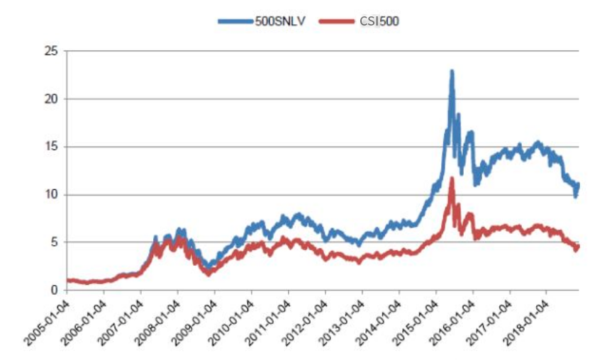

# Strategy 101: Stock Smart Beta ETF

    Performance: annual: 18.83%, ttm: n/a, ytd: 26.68%

  
A stock broad-based index ETF based on two of the most powerful smart beta factors, i.e., small cap & low volatility. China’s counterpart to XSLV ( S&P small cap & low vol ETF) listed in NYSE. A great improvement on both return and volatility, making it an ideal buy-and-hold candidates. The Features table below lists some backtest statistics based on the algorithm back from 2005 through 2018, and since the end of 2018, an ETF (512260.SS) has bee listed publicly to track the industry neutral small cap low volatility index (500SNLV).

      

    Table: Features

| Level | One-time Deposit Ethers | Strategy No. | Underlying | TBC Category | Years | Annualized RoR | Largest Drawdown | R/D | Sharpe Ratio | TTM | YTD |
|-------|-------------------------|--------------|-----------------------|-----------------|--------------|----------------|------------------|-----|--------------|--------|-------|
|1|0.0|101|Stock Smart Beta|1|14.15|18.83%|n/a|n/a|0.63|n/a|26.68%|

    Figure: Net Asset & Draw-down

Updated On: 2019-03-28
    