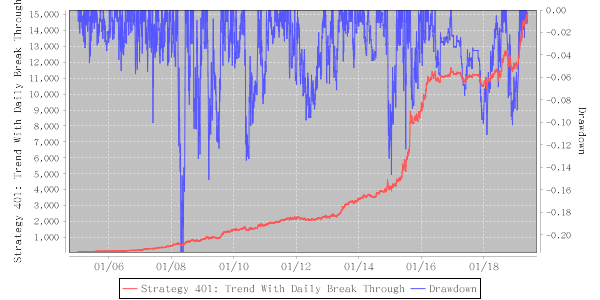

# Strategy 401: Trend With Daily Break Through

    Performance: annual: 41.57%, ttm: 30.60%, ytd: 26.92%

A semi-daily strategy that enhanced the underlying index by providing with an entry tactic to ride the trend, both long and short, with an acceptable relatively low trial-and-error cost.
    

    Table: Features

| Level | One-time Deposit Ethers | Strategy No. | Underlying | TBC Category | Years | Annualized RoR | Largest Drawdown | R/D | Sharpe Ratio | TTM | YTD |
|-------|-------------------------|--------------|-----------------------|-----------------|--------------|----------------|------------------|-----|--------------|--------|-------|
|5|1000.0|501|Single Stock Index|1|14.38|41.57%|-21.96%|1.89|1.84|30.60%|26.92%|

    Figure: Net Asset & Draw-down

Updated On: 2019-05-22
    
