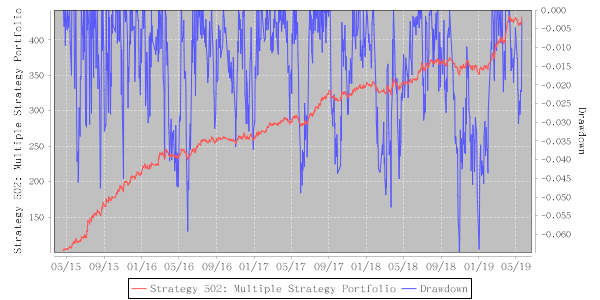

# Strategy 502: Multiple Strategy Portfolio

    Performance: annual: 42.62%, ttm: 25.35%, ytd: 20.19%

  
A strategy portfolio cancels out to an amazing extent the drawdowns of the individual strategy but accumulates profits of each, elevating the combined return/risk profile by an astonishing figure. The daily atom-level rebalancing requirement entails the TBC trading system, which rules out the minimum investment unit.
    

    Table: Features

| Level | One-time Deposit Ethers | Strategy No. | Underlying | TBC Category | Years | Annualized RoR | Largest Drawdown | R/D | Sharpe Ratio | TTM | YTD |
|-------|-------------------------|--------------|-----------------------|-----------------|--------------|----------------|------------------|-----|--------------|--------|-------|
|5|1000.0|502|Multiple Strategy Portfolio|5|4.09|42.62%|-6.60%|6.46|2.36|25.35%|20.19%|

    Figure: Net Asset & Draw-down

Updated On: 2019-05-26
    