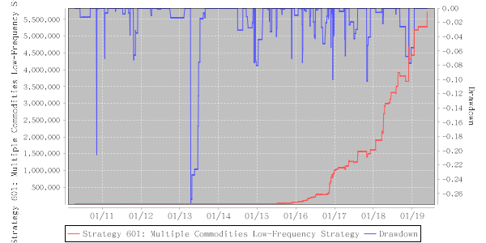

# Strategy 601: Multiple Commodities Low-Frequency Strategy

    Performance: annual: 230.63%, ttm: 76.32%, ytd: 19.14%

  
A strategy that uses a bunch of commodities in the same ultra-low-frequency strategy, which sells itself by a decade-long back-testing result: 240% annualized rate of return and 8.6 R/D! This unbelievable strategy utilizes a fundamental sub-structure of the markets to obtain a high return to risk profile.
    

    Table: Features

| Level | One-time Deposit Ethers | Strategy No. | Underlying | TBC Category | Years | Annualized RoR | Largest Drawdown | R/D | Sharpe Ratio | TTM | YTD |
|-------|-------------------------|--------------|-----------------------|-----------------|--------------|----------------|------------------|-----|--------------|--------|-------|
|6|1500.0|601|Multiple Commodities Strategy|5|9.09|230.63%|-28.06%|8.22|3.37|76.32%|19.14%|

    Figure: Net Asset & Draw-down

Updated On: 2019-05-22
    
