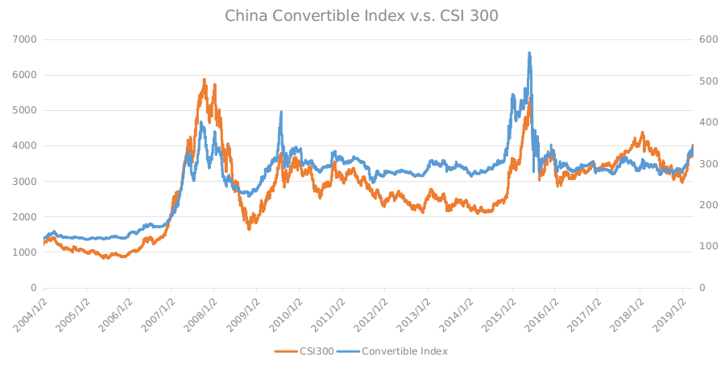

# Bizarre Opportunities in China's Convertible Bonds
Typically the convertibles give investors the hybrid of credit bonds and stock options, the latter could possibly end up valueless. But, what if the strike prices of the embedded options are subject to be lowered arbitrarily to the current stock prices at any time by the issuers who are willing to? This is what is going on with the convertibles in China's market.

The answer comes straightforward that*** the prices of convertibles are floored at no less than 90%*** (or 80% in the secular bear market) of the face value of the bonds in the bear market and ***skyrocket like stocks in the bull***. This is because the embedded options even come with an option to reset the strikes to the current prices that are substantially lower than the strikes by the issuers in China that always deem the cost of equity almost zero and cost of debt a heavy burden. The action of reset immediately puts the embedded options at the money. Obviously, it is the lowerable strikes that are the key to float the prices of the convertibles in the bear market and the embedded options that give the bonds resilience of stocks in the bull. In the short history of the convertibles in China, no issuers expired the embedded options  and redeemed the bonds but all converted bonds into the shares, no matter how much the strike price had been lowered to when converted. 

***The structure of the convertibles, weather it be a feature or a flaw in design, gives rise to big opportunities in a given market situation, i.e., the final phase of the bear market***. Figure 1 is the broad-based stock index versus the convertible index that is now discontinued and thus nontradable on TBC, showing obviously the bottomed pattern of the convertibles compared with the market.  In a secular bear market, once  the majority of the convertibles are traded around 90, no matter how low the stock market will go, the convertibles hang between 80 - 90 and wait for the issuers to come in to lower the strikes to the current price of the underlying stocks,*** thus simply setting the embedded options at the money and bring the prices of the convertibles above 110 immediately***,  and the following bull market makes the convertibles synchronous with the underlying stocks in terms of rate of return. This pattern is vividly demonstrated in Figure 1.

>Figure 1.

>

***In a nutshell, the convertibles offer opportunities for investors to establish positions in the final phase of the bear markets with the expectation of more than 3x of rate of return by the draw-down.***

But how to trade the convertibles on TBC given the convertible index discontinued? There are individual convertible bonds tradable in the market, joined by dozen of new on a weekly basis. https://www.jisilu.cn/data/cbnew/#cb is a good starting point, which lists all the convertibles in the market. Please be noted that the ticker symbol starting with '11' has to be suffixed with '.SS' and the one starting with '12' has to be suffixed with '.SZ' when trading on TBC. Nevertheless, always remember to get the quotes to make sure the symbol is correct before placing orders

