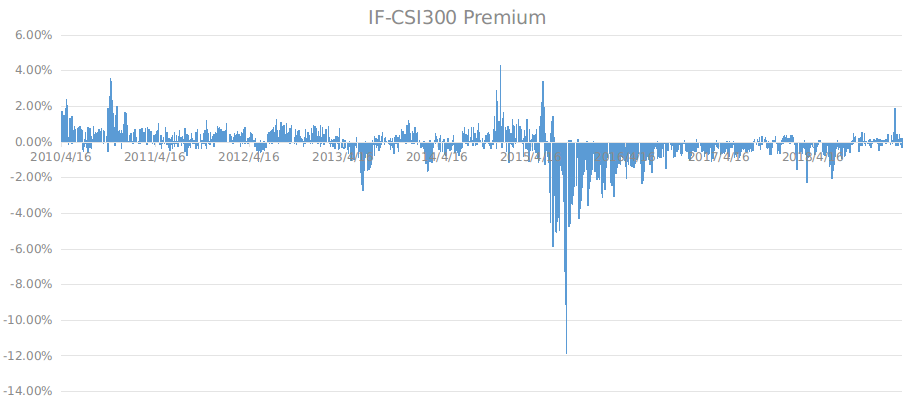

# How to gain RISK FREE profit from arbitrage on China's stock index futures  

Stock broad-based indices that are only   tradable on the TBC makes stock index arbitrage as easy as snapping fingers, and much more profitable (to be exact*** 15-25%*** by our strategy) than the original arbitrage strategy and ***the most amazingly risk free ***!

Stock index arbitrage comes from the premium of stock futures price over the underlying stock index, the positive called contango and the negative called backwardation. 

China's stock index futures see a lot of fluctuation and shift between backwardation and contango, i.e.,  within one trading day premium could drift between 1% backwardation and 1% contango, and extreme situations with as much as 12% backwardation. However in the original market, the anomaly comes for a reason：backwardation/contango arbitrage requires tradable, both longable and shortable, stock instruments, e.g., ETFs tracking the broad-based stock indices, which are technically absent in the China's market.

The TBC trading system, nevertheless, enables  the tradability of stock indices that have futures, making the arbitrage **handy, efficient, accurate and technically profitable**. Take CSI300 index (000300.SS on TBC) for an example, when the market tops out, the hysteria pushes the contango to unbelievable 5% on a couple of trading dates on its less decade history, e.g., 3.6% on Oct. 22, 2010 and 4.3% on Dec. 18, 2014 . In such situations, simply buy 000300.SS with the desirable leverage on the TBC and open short positions of the same nominal equity of the CSI300 futures IF in its original market, putting you in a risk free position that guarantees a minimum 50% in less than 10 days on the leveraged captial.  Another amazing opportunity comes in the recent days when the market sees the drift of the premium even in a single trading date.  The same tactics could be utilized to gain from the fluctuation. For the other situations where backwardation/contango decays gradually while the future is expiring, hedging 000300.SS on the TBC against the futures is much accurate than any traditional arsenals like ETFs, because the futures always expires at the close price of the underlying rather than that of ETFs. Besides, the built-in leverage on the TBC uses much less capital.

Based on the historical backwardation/contango , hedging 000300.SS on the TBC against IF positions and simultaneously hedging TBC against CNY makes a totally **_RISK FREE_** strategy that expects a 25% annual rate of return! 

>Figure 1.

Here is how to achieve that unbelievable goal!

Figure 1 shows the all historical daily premium of the front future contract over the CSI300 stock index. A few outliers identify themselves great opportunities of arbitrage, a couple of which were mentioned above. However, these outliers are not the way to obtain the stable risk free arbitrage profits. 

Let us take a look at the Table 1, which lists the largest backwardation/contango on a monthly basis. Image this simple and straightforward strategy:  whenever either backwardation or contango reaches 0.5%, hedge positions are opened that include futures positions in China Financial Futures Exchange  and opposite 000300.SS positions on the TBC, a portfolio that translates into a 0.25% risk free profits on nominal investment or 2.08% on the  capital leveraged by 8.3x. Taking into consideration that this kind of opportunity existed almost every month (102/109), this strategy historically for the past almost 9 years achieved 3% annualized rate of return on nominal investment or *** 25% on the captial with leverage of 8.3x***. If we lower the leverage from 8.3x, which is a reverse of the margin requirement by brokers and on the TBC it can be as high as 20x for 000300.SS, to 5x that can tolerate 20% movement of the index within a month in order to lower the possibility of margin call, ***we will get 15% annually, and remember, this is achieved on a RISK FREE basis !***

Please be noted that the 0.5% threshold in the previous strategy is based on the daily close premium. If we incorporate the intra-day data, this threshold can be loosen to 1%, which will definitely translate into an even higher rate of return. This back-test will be left for the users of TBC themselves.

Table 1.

| YYMM    | Max Contango | Max Backwardation |
|---------|--------------|-------------------|
| 2010/04 | 1.77%        | 0.63%             |
| 2010/05 | 2.44%        | -0.19%            |
| 2010/06 | 0.93%        | 0.05%             |
| 2010/07 | 0.83%        | -0.63%            |
| 2010/08 | 0.88%        | -0.38%            |
| 2010/09 | 0.80%        | -0.04%            |
| 2010/10 | 3.59%        | -0.57%            |
| 2010/11 | 2.37%        | -0.23%            |
| 2010/12 | 1.72%        | -0.39%            |
| 2011/01 | 0.73%        | -0.12%            |
| 2011/02 | 0.81%        | -0.12%            |
| 2011/03 | 0.87%        | -0.17%            |
| 2011/04 | 1.06%        | -0.19%            |
| 2011/05 | 0.83%        | -0.37%            |
| 2011/06 | 0.58%        | -0.48%            |
| 2011/07 | 0.70%        | -0.29%            |
| 2011/08 | 0.79%        | -0.77%            |
| 2011/09 | 0.72%        | -0.40%            |
| 2011/10 | 0.69%        | -0.36%            |
| 2011/11 | 1.26%        | -0.41%            |
| 2011/12 | 0.90%        | -0.02%            |
| 2012/01 | 1.09%        | 0.22%             |
| 2012/02 | 0.63%        | -0.12%            |
| 2012/03 | 0.85%        | -0.26%            |
| 2012/04 | 0.56%        | -0.25%            |
| 2012/05 | 0.23%        | -1.11%            |
| 2012/06 | 0.56%        | -0.53%            |
| 2012/07 | 1.30%        | -0.11%            |
| 2012/08 | 1.11%        | -0.05%            |
| 2012/09 | 1.05%        | -0.13%            |
| 2012/10 | 0.76%        | -0.15%            |
| 2012/11 | 0.74%        | -0.26%            |
| 2012/12 | 0.98%        | -0.12%            |
| 2013/01 | 0.94%        | -0.28%            |
| 2013/02 | 0.88%        | -0.27%            |
| 2013/03 | 0.36%        | -0.45%            |
| 2013/04 | 0.78%        | -0.40%            |
| 2013/05 | 0.02%        | -1.09%            |
| 2013/06 | 0.28%        | -2.43%            |
| 2013/07 | 0.07%        | -2.73%            |
| 2013/08 | 0.35%        | -0.97%            |
| 2013/09 | 0.54%        | -0.34%            |
| 2013/10 | 0.31%        | -0.65%            |
| 2013/11 | 0.74%        | -0.55%            |
| 2013/12 | 1.27%        | -0.10%            |
| 2014/01 | 0.87%        | -0.15%            |
| 2014/02 | 0.10%        | -0.67%            |
| 2014/03 | 0.11%        | -1.67%            |
| 2014/04 | 0.49%        | -0.54%            |
| 2014/05 | 0.21%        | -0.78%            |
| 2014/06 | 0.41%        | -0.63%            |
| 2014/07 | 0.87%        | -0.77%            |
| 2014/08 | 0.84%        | -0.23%            |
| 2014/09 | 1.09%        | -0.24%            |
| 2014/10 | 0.59%        | -0.36%            |
| 2014/11 | 1.45%        | -0.39%            |
| 2014/12 | 4.32%        | -0.38%            |
| 2015/01 | 0.88%        | -1.16%            |
| 2015/02 | 1.30%        | -0.35%            |
| 2015/03 | 1.28%        | -0.86%            |
| 2015/04 | 0.85%        | -1.12%            |
| 2015/05 | 2.26%        | -1.18%            |
| 2015/06 | 3.40%        | -4.23%            |
| 2015/07 | 1.46%        | -5.89%            |
| 2015/08 | -0.35%       | -9.12%            |
| 2015/09 | 0.12%        | -11.89%           |
| 2015/10 | 0.20%        | -4.32%            |
| 2015/11 | 0.00%        | -3.57%            |
| 2015/12 | 0.01%        | -2.15%            |
| 2016/01 | -0.10%       | -3.16%            |
| 2016/02 | -0.10%       | -3.07%            |
| 2016/03 | -0.04%       | -2.27%            |
| 2016/04 | -0.09%       | -2.08%            |
| 2016/05 | -0.15%       | -1.43%            |
| 2016/06 | -0.22%       | -2.38%            |
| 2016/07 | -0.18%       | -1.72%            |
| 2016/08 | 0.03%        | -0.97%            |
| 2016/09 | -0.08%       | -1.51%            |
| 2016/10 | -0.04%       | -0.92%            |
| 2016/11 | -0.01%       | -0.76%            |
| 2016/12 | 0.09%        | -1.07%            |
| 2017/01 | 0.17%        | -0.55%            |
| 2017/02 | -0.22%       | -0.85%            |
| 2017/03 | 0.00%        | -1.12%            |
| 2017/04 | 0.09%        | -0.74%            |
| 2017/05 | 0.07%        | -0.85%            |
| 2017/06 | 0.07%        | -0.87%            |
| 2017/07 | -0.01%       | -0.91%            |
| 2017/08 | 0.20%        | -0.57%            |
| 2017/09 | 0.33%        | -0.43%            |
| 2017/10 | 0.31%        | -0.70%            |
| 2017/11 | 0.35%        | -0.73%            |
| 2017/12 | 0.37%        | -0.69%            |
| 2018/01 | 0.42%        | -0.04%            |
| 2018/02 | -0.02%       | -1.55%            |
| 2018/03 | 0.04%        | -2.27%            |
| 2018/04 | -0.02%       | -0.79%            |
| 2018/05 | 0.12%        | -0.76%            |
| 2018/06 | -0.13%       | -2.05%            |
| 2018/07 | 0.10%        | -1.62%            |
| 2018/08 | -0.10%       | -0.96%            |
| 2018/09 | 0.52%        | -0.62%            |
| 2018/10 | 0.55%        | -0.55%            |
| 2018/11 | 0.50%        | -0.35%            |
| 2018/12 | 0.21%        | -0.49%            |
| 2019/01 | 0.32%        | -0.25%            |
| 2019/02 | 1.90%        | -0.16%            |
| 2019/03 | 0.43%        | -0.36%            |

